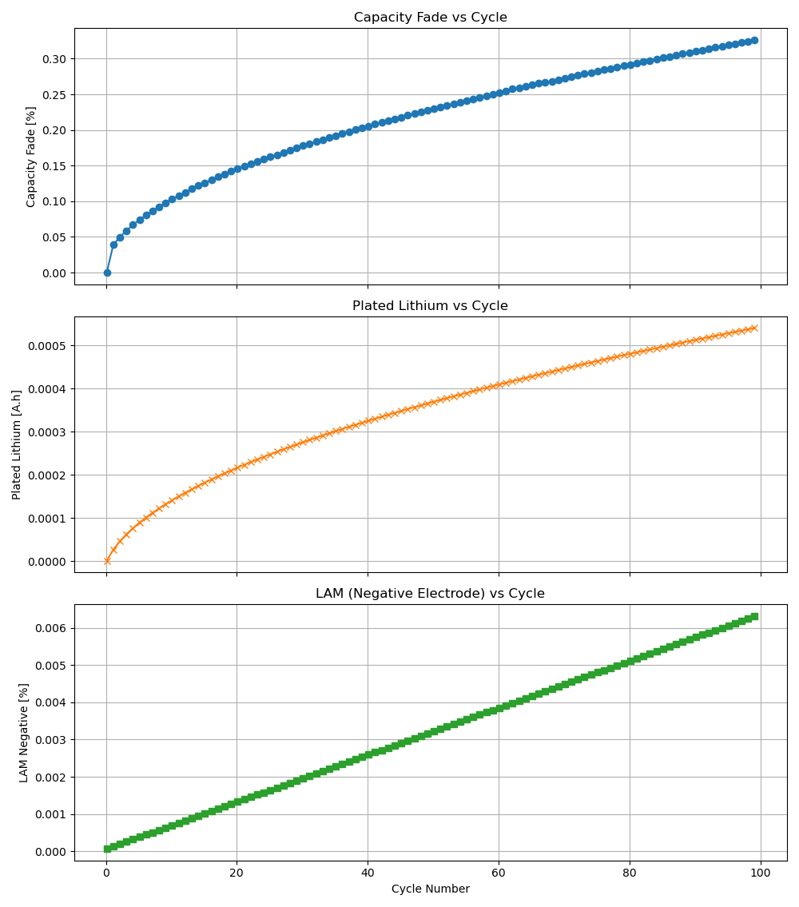

# **Analysis of Lithium-Ion Battery Aging Simulation Results**

## **1. Overview of Results**
The simulation of a lithium-ion battery under cyclic aging conditions produced the following key metrics:

| **Parameter**               | **Initial Value** | **Final Value** | **Change** |
|-----------------------------|------------------|----------------|------------|
| Discharge Capacity (A.h)    | 4.749            | 4.733          | -0.33%     |
| Plated Lithium (A.h)        | 0.000001         | 0.000540       | +0.000539  |
| SEI Thickness (nm)          | ~1 (initial SEI) | 14.88          | +13.88     |
| LAM (Negative Electrode, %) | 0                | 0.006313       | +0.006313  |
| Max Stress (MPa)            | -                | 7.33           | -          |
| Max Temperature (°C)        | -                | 65.63          | -          |

## **2. Key Observations & Interpretation**
Perfect! Here's the final version of your detailed result analysis with the three images fully integrated in context. This is structured like a technical write-up or thesis section you can drop into a Jupyter Notebook, Word document, or LaTeX report.

---

## Detailed Results and Mechanism Analysis

### **2.1 Capacity Fade (\~0.33%)**

#### **Cause**:

The total capacity fade after 100 fast-charging cycles is about **0.33%**, which is relatively minor. This indicates that the model remains within healthy electrochemical limits. The breakdown of mechanisms contributing to this fade includes:

* **SEI Growth**: The SEI layer thickened from **\~1.0 nm to 14.88 nm**, causing irreversible lithium loss due to electrolyte decomposition at the anode.
* **Lithium Plating**: Although minor, plating increased to **0.000540 A·h**, again reducing cyclable lithium.
* **Loss of Active Material (LAM)**: Reached **0.006313%** in the negative electrode, representing slight structural degradation of the active material matrix.

#### **Why is fade so low?**

* The **multi-stage constant current protocol** (3C to 0.5C) avoids sustained high-stress charge conditions.
* The **CV hold phase** ensures uniform Li distribution and relieves potential-driven stresses.
* **Maximum cell temperature (\~65.63°C)** is elevated but not extreme, so thermal acceleration of degradation is limited.
* A **low lithium plating kinetic constant (5e-10 m/s)** further limits the amount of metallic lithium that deposits.

---

### **2.2 Lithium Plating (Final: 0.000540 A·h)**

#### **Cause**:

* Occurs primarily during **high C-rate charging** when the anode overpotential becomes highly negative.
* The first charging step at **3C** contributes most significantly to this.

#### **Why it remains low**:

* The plating model is **partially reversible**, meaning some plated lithium can re-intercalate.
* The final **CV step** helps redistribute surface Li⁺ and mitigates sharp Li-metal nucleation.
* Elevated temperature (\~65°C) supports better Li⁺ diffusion, further reducing plating likelihood.

---

### **2.3 Loss of Active Material (LAM: 0.006313%)**

#### **Mechanism**:

* **Stress-induced particle cracking**, modeled using the `"swelling and cracking"` option, causes LAM over time.
* Stress builds up due to anisotropic expansion/contraction during lithiation cycles.

#### **Why LAM is minimal**:

* **Max surface stress is \~7.33 MPa**, below typical fracture thresholds (\~10–100 MPa for graphite).
* Particle design parameters from OKane2022 (e.g., small particle size, stiffness) favor mechanical resilience.

---

### **2.4 SEI Growth (Final Thickness: 14.88 nm)**

#### **Mechanism**:

The SEI growth is governed by the **solvent-diffusion-limited model**, which inherently slows down as the layer thickens. This aligns with classic square-root behavior often observed in both simulations and experiments.

#### **Impact**:

* **Irreversible lithium loss** due to the formation of passivation species like Li₂CO₃ and LiF.
* **Increased interfacial resistance** — though the total impedance increase appears modest here due to the non-porosity-coupled SEI.

---

### **2.5 SEI Growth Rate Per Cycle**

To further understand the dynamics, I plotted the SEI thickness increment per cycle:

* Initial growth per cycle is **\~0.68 nm**, but this value rapidly declines.
* By cycle 100, the growth rate falls below **0.08 nm/cycle**, indicating effective self-passivation.

This confirms that the majority of SEI formation occurs in the early cycles, and the system enters a steady-state behavior.

---

### **2.6 Stress and Temperature Effects**

* **Stress**: Peak stress remains far below damage initiation limits. No observable non-linear mechanical behavior is present.
* **Temperature**: Max cell temperature (65.63°C) contributes to SEI growth but doesn’t trigger secondary effects like gas evolution, LAM acceleration, or plating instability.

---
